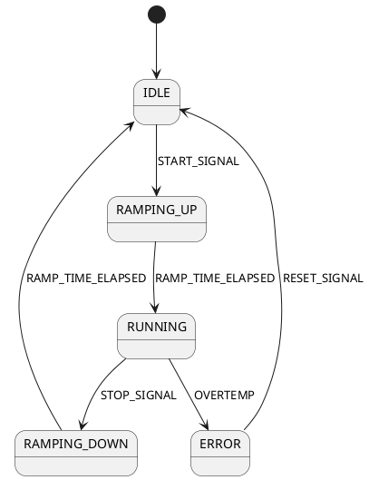

# PLC Documentation Analysis Guide

## Introduction

This guide explains how to analyze the provided PLC (Programmable Logic Controller) documentation and translate it into Python code.

---

## What is a PLC?

A **Programmable Logic Controller (PLC)** is an industrial computer that:
- Reads input signals (sensors, buttons, timers)
- Executes logic based on programmed instructions
- Outputs control signals (motor start/stop, valve position)
- Operates in continuous cycles (typically 10-100 ms per cycle)

PLCs describe systems in terms of:
- **Inputs** — What the system observes (sensors, switches)
- **Outputs** — What the system controls (motors, lights, alarms)
- **Logic** — Rules for how inputs map to outputs
- **State** — Memory of what has happened before

---

## Understanding the Drone Factory Documentation

### Step 1: Identify the Top-Level Systems

Read through the documentation and list major subsystems:

**Example** (from a typical drone factory):
```
1. Assembly Line
   - Conveyor system (belt transport)
   - Pick & place arm (component insertion)
   - Drilling stations (fastening)

2. Quality Control
   - Vision system (inspection)
   - Weight sensor (verification)
   - Test rig (functionality check)

3. Packaging & Shipping
   - Boxing system
   - Label printer
   - Conveyor to shipping

4. Safety System
   - Emergency stop button
   - Collision detection
   - Temperature monitors
   - Interlocks (prevents unsafe operations)
```

**Your Task:** Read the PDF documentation and create a similar list for the drone factory.

### Step 2: Map Component Interfaces

For each component, document:
- **Name** — What is it called?
- **Input Signals** — What does it receive?
- **Output Signals** — What does it produce?
- **States** — What modes/conditions does it have?
- **Timing** — What timing constraints apply?

**Template:**
```
Component: Conveyor Motor 1
├─ Inputs
│  ├─ START_SIGNAL (boolean) - Signal to start motor
│  ├─ SPEED_SETPOINT (0-100%) - Desired speed
│  └─ LOAD_SIGNAL (analog 0-5V) - Current load
├─ Outputs
│  ├─ RUNNING (boolean) - Motor is active
│  ├─ SPEED_ACTUAL (RPM) - Current speed
│  └─ ERROR_FLAG (boolean) - Fault condition
├─ States
│  ├─ IDLE (waiting for start signal)
│  ├─ RAMPING_UP (accelerating to setpoint)
│  ├─ RUNNING (at steady-state speed)
│  ├─ RAMPING_DOWN (decelerating)
│  └─ ERROR (fault condition detected)
└─ Timing Constraints
   ├─ Ramp-up time: 2 seconds
   ├─ Ramp-down time: 1 second
   └─ Cycle time: 100 ms
```

### Step 3: Extract State Machines

Most PLC logic can be represented as **state machines** — diagrams showing states and transitions.

**From documentation, identify:**
- What states can each component be in?
- What triggers a transition from one state to another?
- Are there timing constraints on transitions?
- Can certain transitions not occur? (invalidity)

**Example: Motor State Machine**

```
Start signal received

           ┌──────────┐
           │  IDLE    │
           └────┬─────┘
                │ START_SIGNAL=1
                │
           ┌────▼──────────┐
           │ RAMPING_UP    │
           │ (duration: 2s)│
           └────┬──────────┘
                │ (time > 2s)
                │
           ┌────▼─────┐
           │ RUNNING  │
           └────┬─────┘
                │ START_SIGNAL=0
                │
           ┌────▼──────────┐
           │ RAMPING_DOWN  │
           │ (duration: 1s)│
           └────┬──────────┘
                │ (time > 1s)
                │
           ┌────▼──────────┐
           │ IDLE         │
           └──────────────┘
```

### Step 4: Document Conditions and Logic

For each transition, write out the **condition** in plain English:

**Example:**
```
Transition: IDLE → RAMPING_UP
Condition: START_SIGNAL == 1 AND RUNNING == 0 AND NO_ERROR
Action: Begin accelerating, set internal timer to 0

Transition: RAMPING_UP → RUNNING
Condition: (current_time - start_time) >= 2.0 seconds
Action: Set speed to SPEED_SETPOINT, clear ramp timer

Transition: RUNNING → ERROR
Condition: LOAD > MAX_LOAD_THRESHOLD (30 kg) OR OVERTEMP > 80°C
Action: Immediately stop, set ERROR_FLAG = 1, log fault

Transition: ERROR → IDLE
Condition: Manual reset signal received AND fault resolved
Action: Clear error flag, reset internal state
```

### Step 5: Identify Inter-Component Dependencies

Which components affect which others?

**Example Dependency Map:**
```
Motor 1 (provides power)
    ↓ drives
Conveyor 1 (transports parts)
    ↓ fills
Buffer 1 (part queue)
    ↓ feeds
Assembly Station (uses parts)

If Motor 1 stops → Conveyor 1 must stop
If Conveyor 1 jams → Motor 1 should detect load and alarm
If Buffer 1 is full → Signal back to slow Conveyor 1
```

---

## Common PLC Logic Patterns

### Pattern 1: Simple Signal Forwarding

**Documentation:**
> "When start button is pressed, turn on motor"

**State Machine:**
```
OFF --[START_BUTTON=1]--> ON
ON  --[STOP_BUTTON=1]--> OFF
```

**Python Code:**
```python
class SimpleMotor:
    state: MotorState = MotorState.OFF
    
    def on_start_signal(self):
        if self.state == MotorState.OFF:
            self.state = MotorState.ON
    
    def on_stop_signal(self):
        if self.state == MotorState.ON:
            self.state = MotorState.OFF
```

### Pattern 2: Conditional Logic

**Documentation:**
> "Motor runs only if pressure is above 5 bar AND no error detected"

**Condition:**
```
MOTOR_SHOULD_RUN = (PRESSURE > 5) AND (ERROR_FLAG == 0) AND (START_SIGNAL == 1)
```

**Python Code:**
```python
def should_motor_run(system: SystemState) -> bool:
    motor = system.get_component('motor_1')
    pressure = system.get_component('pressure_sensor').value
    start_signal = system.get_input('START_SIGNAL')
    
    return (
        pressure > 5.0 and
        motor.error_flag == False and
        start_signal == True
    )

def update_motor(motor: Motor, system: SystemState):
    if should_motor_run(system):
        motor.state = MotorState.RUNNING
    else:
        motor.state = MotorState.IDLE
```

### Pattern 3: Sequencing (Multi-Step Processes)

**Documentation:**
> "Welding cycle: (1) Move arm to position (2 sec), (2) Apply heat (5 sec), (3) Cool down (3 sec), (4) Retract (2 sec)"

**State Machine:**
```
IDLE
  │ [START_CYCLE]
  ├→ MOVING_ARM (duration: 2s)
  ├→ APPLYING_HEAT (duration: 5s)
  ├→ COOLING_DOWN (duration: 3s)
  ├→ RETRACTING (duration: 2s)
  └→ IDLE
```

**Python Code:**
```python
from enum import Enum
from datetime import datetime

class WeldingState(Enum):
    IDLE = "idle"
    MOVING_ARM = "moving_arm"
    APPLYING_HEAT = "applying_heat"
    COOLING_DOWN = "cooling_down"
    RETRACTING = "retracting"

@dataclass
class WeldingStation:
    state: WeldingState = WeldingState.IDLE
    step_start_time: datetime = None
    
    def start_cycle(self, current_time: datetime):
        if self.state == WeldingState.IDLE:
            self.state = WeldingState.MOVING_ARM
            self.step_start_time = current_time
    
    def update(self, current_time: datetime):
        """Call periodically to advance through sequence"""
        if self.step_start_time is None:
            return
        
        elapsed = (current_time - self.step_start_time).total_seconds()
        
        if self.state == WeldingState.MOVING_ARM and elapsed >= 2.0:
            self.state = WeldingState.APPLYING_HEAT
            self.step_start_time = current_time
        
        elif self.state == WeldingState.APPLYING_HEAT and elapsed >= 5.0:
            self.state = WeldingState.COOLING_DOWN
            self.step_start_time = current_time
        
        elif self.state == WeldingState.COOLING_DOWN and elapsed >= 3.0:
            self.state = WeldingState.RETRACTING
            self.step_start_time = current_time
        
        elif self.state == WeldingState.RETRACTING and elapsed >= 2.0:
            self.state = WeldingState.IDLE
            self.step_start_time = None
```

### Pattern 4: Hysteresis (Prevent Oscillation)

**Documentation:**
> "Start conveyor if queue < 50 items, stop if queue > 80 items. This prevents constant start/stop."

**State Machine:**
```
STOPPED
  │ [QUEUE < 50]
  └→ RUNNING
     └→ [QUEUE > 80]
        └→ STOPPED
```

**Python Code:**
```python
class Conveyor:
    state: ConveyorState = ConveyorState.STOPPED
    
    def update(self, queue_length: int):
        if self.state == ConveyorState.STOPPED and queue_length < 50:
            self.state = ConveyorState.RUNNING
        elif self.state == ConveyorState.RUNNING and queue_length > 80:
            self.state = ConveyorState.STOPPED
```

### Pattern 5: Error Handling and Reset

**Documentation:**
> "If sensor fails (no update for 5 sec), raise SENSOR_ERROR. Operator must press RESET to clear."

**State Machine:**
```
NORMAL
  │ [NO_UPDATE FOR 5 SEC]
  └→ ERROR_STATE
     └→ [RESET_BUTTON PRESSED]
        └→ NORMAL
```

**Python Code:**
```python
class Sensor:
    state: SensorState = SensorState.NORMAL
    last_update_time: datetime = datetime.now()
    
    def on_reading(self, value: float, current_time: datetime):
        self.last_update_time = current_time
        self.value = value
        if self.state == SensorState.ERROR:
            self.state = SensorState.NORMAL
    
    def check_health(self, current_time: datetime):
        """Call periodically to check for staleness"""
        elapsed = (current_time - self.last_update_time).total_seconds()
        if elapsed > 5.0 and self.state == SensorState.NORMAL:
            self.state = SensorState.ERROR
    
    def reset(self):
        if self.state == SensorState.ERROR:
            self.state = SensorState.NORMAL
```

---

## Translation Workflow

### Step 1: Document the System (Manual)

Create a **system analysis document** with:
- List of all components
- Input/output signals for each
- State diagrams
- Timing constraints
- Inter-component dependencies

### Step 2: Create Python Data Structures

For each component, create:
- An **Enum** for states
- A **dataclass** for component data

```python
class MotorState(Enum):
    IDLE = "idle"
    RUNNING = "running"
    ERROR = "error"

@dataclass
class Motor:
    id: str
    state: MotorState = MotorState.IDLE
    speed_rpm: float = 0.0
    error_flag: bool = False
```

### Step 3: Implement Transition Logic

Write functions that implement each transition:

```python
def start_motor(motor: Motor, system: SystemState):
    """Start signal received"""
    if motor.state == MotorState.IDLE:
        motor.state = MotorState.RUNNING
        motor.speed_rpm = 100.0
        return True
    return False

def stop_motor(motor: Motor):
    """Stop signal received"""
    if motor.state == MotorState.RUNNING:
        motor.state = MotorState.IDLE
        motor.speed_rpm = 0.0
        return True
    return False
```

### Step 4: Test Against Documentation

For each state machine, write unit tests:

```python
def test_motor_start():
    motor = Motor(id='m1')
    assert motor.state == MotorState.IDLE
    assert start_motor(motor, system) == True
    assert motor.state == MotorState.RUNNING

def test_motor_invalid_start():
    motor = Motor(id='m1', state=MotorState.RUNNING)
    assert start_motor(motor, system) == False  # Already running
    assert motor.state == MotorState.RUNNING  # State unchanged
```

### Step 5: Integrate into Simulator

Connect your components to the simulator:

```python
def simulate_step(system: SystemState, current_time: datetime):
    """Advance simulation by one time step"""
    # Check inputs and apply logic
    if system.get_input('START_MOTOR_1'):
        start_motor(system.get_component('motor_1'), system)
    
    # Update time-dependent states
    for component in system.components.values():
        if hasattr(component, 'update'):
            component.update(current_time)
    
    # Log changes
    logger.log_system_state(system, current_time)
```

---

## Common Challenges & Solutions

### Challenge 1: Timing Constraints Are Vague

**Problem:** Documentation says "takes about 2 seconds" but doesn't specify exactly

**Solution:** 
- Use best estimate for initial implementation
- Make it configurable: `RAMP_UP_TIME = 2.0`
- Test against real system data if available
- Document your assumption in code

```python
# In config.py
MOTOR_RAMP_UP_TIME_SECONDS = 2.0  # From documentation: "approximately 2 seconds"

# In component
def _finish_ramp_up(self):
    self.state = MotorState.RUNNING
```

### Challenge 2: Documentation Has Conflicts

**Problem:** Two parts of the documentation say different things

**Solution:**
- Flag the conflict clearly
- Choose one interpretation
- Document your choice
- Plan to verify against real system

```python
# NOTE: Documentation section 3.2 says motor can't run if pressure < 5 bar
# but section 7.1 says it runs at pressure >= 4 bar. We implement 5 bar.
# TODO: Verify with actual system
MIN_PRESSURE_BAR = 5.0
```

### Challenge 3: Missing Details

**Problem:** Documentation doesn't specify what happens in edge case X

**Solution:**
- Make reasonable assumption
- Document it clearly
- Make it testable
- Plan to verify

```python
# ASSUMPTION: If motor exceeds 80°C and cooling can't keep up,
# system shuts down (conservative approach). Alternative would be
# to throttle speed. Verify with domain expert.
if motor.temperature > 80.0:
    motor.state = MotorState.ERROR
```

### Challenge 4: Extracting Logic from Diagrams

**Problem:** Diagram shows state machine but no transition conditions

**Solution:**
- Try to infer from context
- Ask domain experts
- Test to see what actually works
- Document your inference

```python
# From diagram, motor transitions RUNNING→IDLE when?
# Inference: When STOP_SIGNAL received or ERROR occurs
def handle_stop_signal(motor: Motor):
    if motor.state in [MotorState.RUNNING, MotorState.WARMING_UP]:
        motor.state = MotorState.IDLE
```

---

## Tools for PLC Documentation Analysis

### Tool 1: Create a Component Inventory

**Script: `tools/plc_parser.py`**

Creates a structured list of all components from documentation:

```bash
python tools/plc_parser.py --input Kod_WSConv_Sven2022.pdf --output components.csv
```

Output format:
```csv
component_name,component_type,inputs,outputs,states,timing_constraints
Motor_1,electric_motor,"START,SPEED_SETPOINT","RUNNING,ERROR","IDLE,RAMPING,RUNNING","ramp_up:2s"
Sensor_1,proximity_sensor,"--","DETECTED","ON,OFF","--"
```

### Tool 2: Visualize State Machines

Use diagrams to organize documentation:
- **Tool:** draw.io, Lucidchart, or PlantUML
- **Example:**


### Tool 3: Checklist for Completeness

Before starting implementation, verify:

- [ ] All major components identified
- [ ] All component states listed
- [ ] All state transitions documented
- [ ] All timing constraints specified
- [ ] All inter-component dependencies mapped
- [ ] All error cases identified
- [ ] Ambiguities flagged and resolved
- [ ] Assumptions documented

---

## Example: Complete Translation

### 1. Documentation says:
> "Conveyor system consists of:
> - Motor that can be started/stopped
> - Motor accelerates over 2 seconds to target speed
> - Load sensor measures conveyor load
> - System stops if load exceeds 50 kg
> - Operator can reset if load is cleared"

### 2. Create state machine:
```
IDLE
  ├─[START]──> ACCELERATING (2 sec)
  └─(return from ACCELERATING)
       ├─[LOAD < 50kg]──> RUNNING
       └─[LOAD ≥ 50kg]──> ERROR
           ├─[LOAD < 50kg, RESET]──> IDLE
           └─(stay in ERROR)
RUNNING
  ├─[LOAD ≥ 50kg]──> ERROR
  └─[STOP]──> IDLE
```

### 3. Implement in Python:

```python
from enum import Enum
from dataclasses import dataclass
from datetime import datetime

class ConveyorState(Enum):
    IDLE = "idle"
    ACCELERATING = "accelerating"
    RUNNING = "running"
    ERROR = "error"

@dataclass
class Conveyor:
    id: str
    state: ConveyorState = ConveyorState.IDLE
    speed_rpm: float = 0.0
    target_speed_rpm: float = 100.0
    load_kg: float = 0.0
    accel_start_time: datetime = None
    
    ACCEL_TIME = 2.0  # seconds
    MAX_LOAD = 50.0   # kg
    
    def start(self, timestamp: datetime):
        if self.state == ConveyorState.IDLE:
            self.state = ConveyorState.ACCELERATING
            self.accel_start_time = timestamp
    
    def stop(self):
        if self.state in [ConveyorState.RUNNING, ConveyorState.ACCELERATING]:
            self.state = ConveyorState.IDLE
            self.speed_rpm = 0.0
            self.accel_start_time = None
    
    def reset(self):
        if self.state == ConveyorState.ERROR and self.load_kg < self.MAX_LOAD:
            self.state = ConveyorState.IDLE
    
    def update(self, timestamp: datetime):
        # Acceleration ramp
        if self.state == ConveyorState.ACCELERATING:
            elapsed = (timestamp - self.accel_start_time).total_seconds()
            progress = min(elapsed / self.ACCEL_TIME, 1.0)
            self.speed_rpm = self.target_speed_rpm * progress
            
            if elapsed >= self.ACCEL_TIME:
                # Finished accelerating, check load
                if self.load_kg < self.MAX_LOAD:
                    self.state = ConveyorState.RUNNING
                else:
                    self.state = ConveyorState.ERROR
        
        # Load check during running
        elif self.state == ConveyorState.RUNNING:
            if self.load_kg >= self.MAX_LOAD:
                self.state = ConveyorState.ERROR
                self.speed_rpm = 0.0
```

### 4. Test:

```python
def test_conveyor_normal_operation():
    conv = Conveyor(id='c1')
    t0 = datetime(2024, 1, 1, 10, 0, 0)
    
    # Start conveyor
    conv.start(t0)
    assert conv.state == ConveyorState.ACCELERATING
    
    # After 1 sec (still accelerating)
    t1 = t0 + timedelta(seconds=1)
    conv.update(t1)
    assert conv.state == ConveyorState.ACCELERATING
    assert 40 < conv.speed_rpm < 60  # ~50% of target
    
    # After 2 sec (finished accelerating, load OK)
    t2 = t0 + timedelta(seconds=2)
    conv.load_kg = 30  # Load is OK
    conv.update(t2)
    assert conv.state == ConveyorState.RUNNING
    assert conv.speed_rpm == 100.0

def test_conveyor_overload():
    conv = Conveyor(id='c1')
    t0 = datetime(2024, 1, 1, 10, 0, 0)
    
    conv.start(t0)
    
    # After 2 sec but load is too high
    t2 = t0 + timedelta(seconds=2)
    conv.load_kg = 60  # OVERLOAD
    conv.update(t2)
    assert conv.state == ConveyorState.ERROR
    assert conv.speed_rpm == 0.0
    
    # Clear load and reset
    conv.load_kg = 20
    conv.reset()
    assert conv.state == ConveyorState.IDLE
```

---

## Next Steps

1. **Read the PDF documentation** — Understand the drone factory system
2. **Create a component inventory** — List all parts and their interfaces
3. **Draw state machines** — For each major component
4. **Create the Python data structures** — Enums and dataclasses
5. **Implement logic** — Translate state machines to code
6. **Write tests** — Verify against documentation
7. **Integrate into simulator** — Connect to simulation engine

## References

- [ARCHITECTURE.md](ARCHITECTURE.md) — Overall system design
- [PROJECT_PHASES.md](PROJECT_PHASES.md) — Phase 1 tasks in detail
- `src/mock_up/` — Example implementation
- `tests/` — Example tests

Good luck with your analysis!
